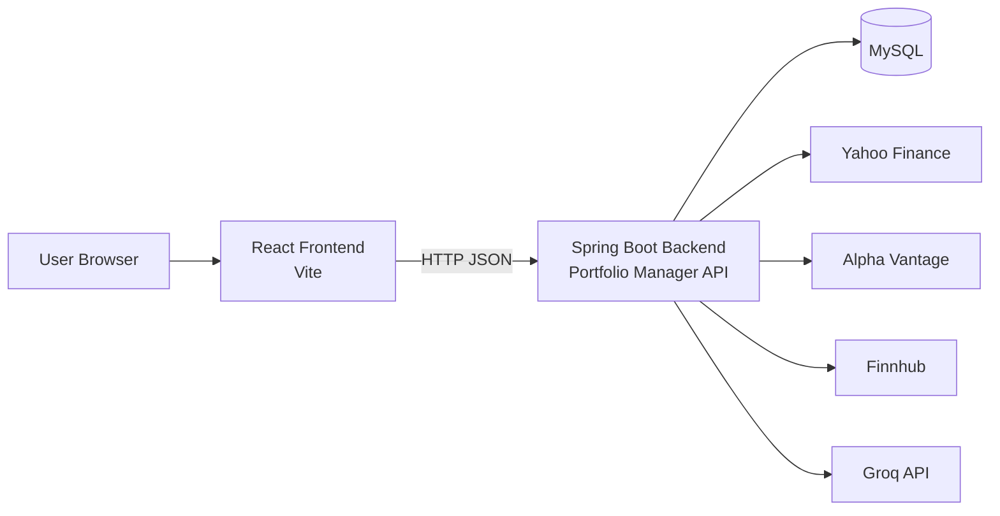
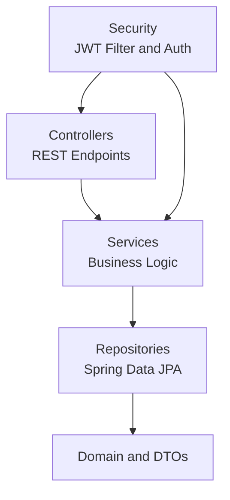
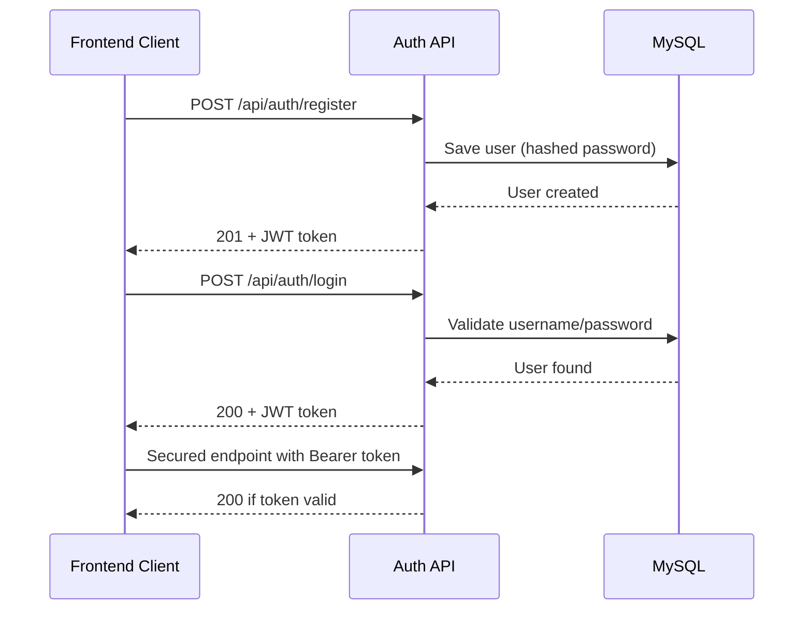
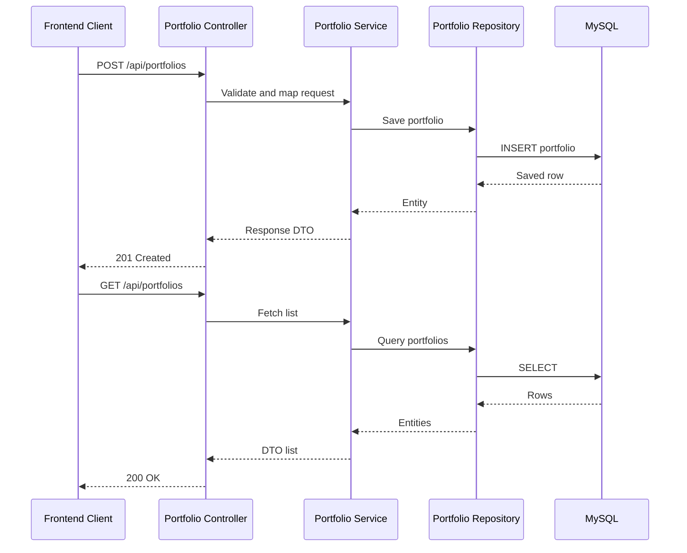
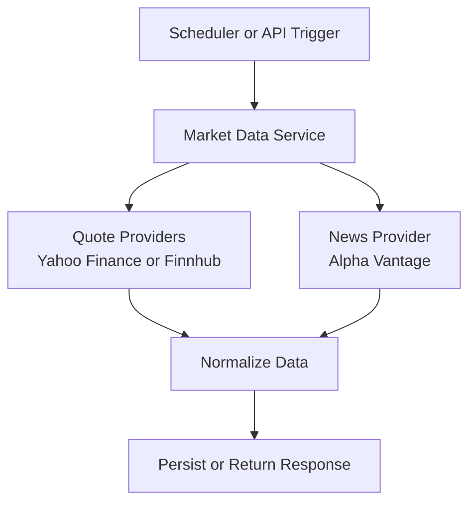
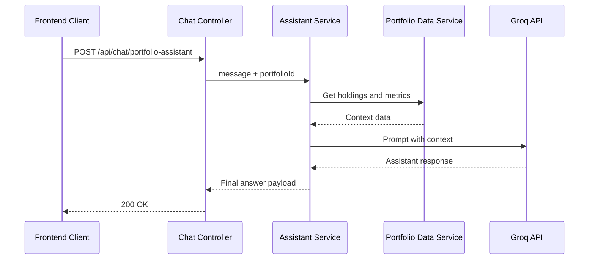
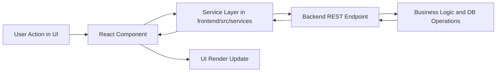

# Portfolio Manager Architecture and Workflow Diagrams

This document provides visual references for the project architecture and key workflows.

## 1. High-Level System Architecture

## 2. Backend Layered Architecture

## 3. Authentication Workflow

## 4. Portfolio CRUD Workflow

## 5. Market Data and News Workflow

## 6. Portfolio Assistant Workflow

## 7. End-to-End User Request Workflow

