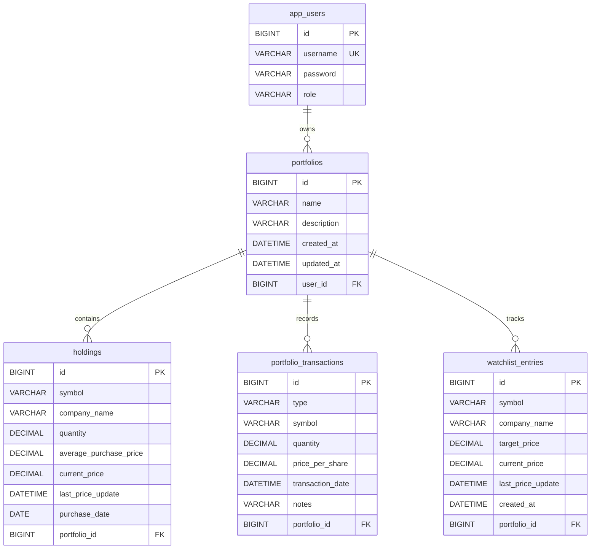

# Database Schema Documentation

This document describes the database schema used by the Portfolio Manager backend.

## 1. Overview

- Database engine: MySQL 8+
- ORM: Spring Data JPA with Hibernate
- DDL mode: update (tables are created and evolved by Hibernate)

Primary data domains:
- Users
- Portfolios
- Holdings
- Transactions
- Watchlist entries

## 2. Entity-to-Table Mapping

| Entity Class | Table Name |
| --- | --- |
| AppUser | app_users |
| Portfolio | portfolios |
| Holding | holdings |
| Transaction | portfolio_transactions |
| Watchlist | watchlist_entries |

## 3. Table Definitions

### 3.1 app_users

Purpose: Stores authentication users.

Columns:
- id: BIGINT, primary key, auto-increment
- username: VARCHAR(100), not null, unique
- password: VARCHAR(255), not null
- role: VARCHAR(30), not null, default ROLE_USER

Constraints:
- Primary key: id
- Unique key: uk_app_user_username on username

### 3.2 portfolios

Purpose: Top-level container for holdings, transactions, and watchlist entries.

Columns:
- id: BIGINT, primary key, auto-increment
- name: VARCHAR(100), not null
- description: VARCHAR(500), nullable
- created_at: DATETIME, not null, set at insert
- updated_at: DATETIME, not null, updated at insert and update
- user_id: BIGINT, foreign key to app_users.id, nullable at DB level

Constraints:
- Primary key: id
- Foreign key: user_id references app_users(id)

Notes:
- created_at and updated_at are populated by @PrePersist and @PreUpdate lifecycle hooks.

### 3.3 holdings

Purpose: Tracks current position per symbol inside a portfolio.

Columns:
- id: BIGINT, primary key, auto-increment
- symbol: VARCHAR(20), not null
- company_name: VARCHAR(150), nullable
- quantity: DECIMAL(19,6), not null
- average_purchase_price: DECIMAL(19,4), not null
- current_price: DECIMAL(19,4), nullable
- last_price_update: DATETIME, nullable
- purchase_date: DATE, nullable
- portfolio_id: BIGINT, not null, foreign key to portfolios.id

Constraints:
- Primary key: id
- Foreign key: portfolio_id references portfolios(id)
- Unique key: uk_holding_portfolio_symbol on (portfolio_id, symbol)

### 3.4 portfolio_transactions

Purpose: Stores buy, sell, and dividend events for each portfolio.

Columns:
- id: BIGINT, primary key, auto-increment
- type: VARCHAR(20), not null, enum values: BUY, SELL, DIVIDEND
- symbol: VARCHAR(20), not null
- quantity: DECIMAL(19,6), not null
- price_per_share: DECIMAL(19,4), not null
- transaction_date: DATETIME, not null
- notes: VARCHAR(500), nullable
- portfolio_id: BIGINT, not null, foreign key to portfolios.id

Constraints:
- Primary key: id
- Foreign key: portfolio_id references portfolios(id)

### 3.5 watchlist_entries

Purpose: Tracks symbols watched in each portfolio.

Columns:
- id: BIGINT, primary key, auto-increment
- symbol: VARCHAR(20), not null
- company_name: VARCHAR(150), nullable
- target_price: DECIMAL(19,4), nullable
- current_price: DECIMAL(19,4), nullable
- last_price_update: DATETIME, nullable
- created_at: DATETIME, not null, set at insert
- portfolio_id: BIGINT, not null, foreign key to portfolios.id

Constraints:
- Primary key: id
- Foreign key: portfolio_id references portfolios(id)
- Unique key: uk_watchlist_portfolio_symbol on (portfolio_id, symbol)

## 4. Relationships

- One app_users row can own many portfolios rows.
- One portfolios row can have many holdings rows.
- One portfolios row can have many portfolio_transactions rows.
- One portfolios row can have many watchlist_entries rows.

Cascade behavior from Portfolio entity:
- holdings, transactions, and watchlist_entries are configured with cascade ALL and orphanRemoval true.

## 5. ER Diagram

## 6. Index and Constraint Notes

Explicit constraints defined in entity mappings:
- uk_app_user_username on app_users.username
- uk_holding_portfolio_symbol on holdings(portfolio_id, symbol)
- uk_watchlist_portfolio_symbol on watchlist_entries(portfolio_id, symbol)

InnoDB will also index primary keys and foreign keys.

## 7. Migration and Evolution Guidance

Current behavior uses automatic schema update. For production-grade schema management, prefer versioned migrations.

Recommended options:
- Flyway
- Liquibase

Suggested baseline migration scope:
- Create all tables and constraints listed above
- Add explicit FK names and indexes
- Add seed roles and optional bootstrap user logic if needed
