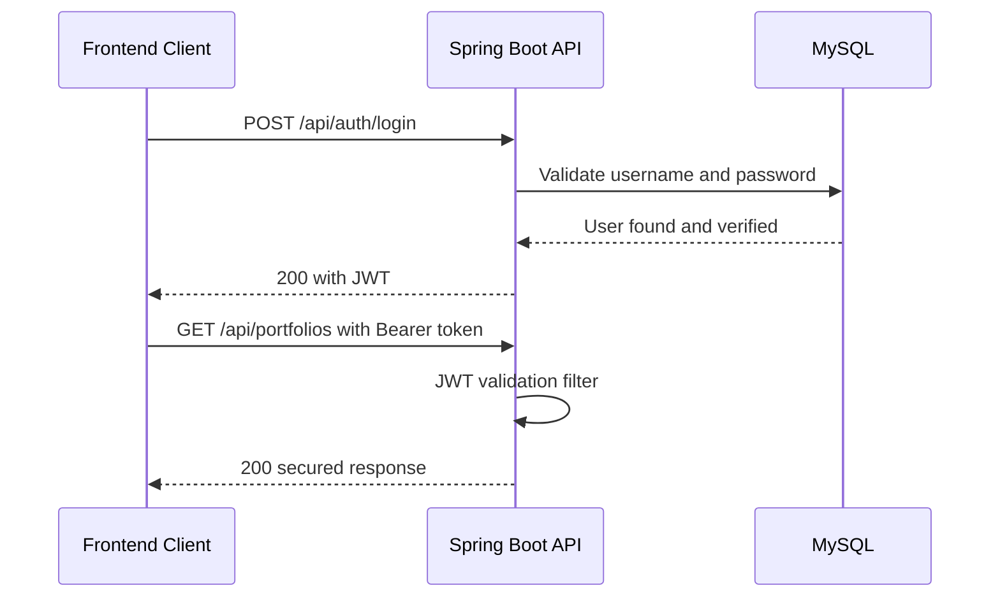

# JWT Authentication Flow

This document explains how JWT authentication works in the Portfolio Manager backend.

## 1. Overview

The API uses Bearer tokens (JWT) for secured endpoints.

High-level flow:
1. User registers or logs in.
2. Backend validates credentials.
3. Backend issues a JWT token.
4. Client sends the token in the Authorization header.
5. Backend filter validates token on each secured request.

## 2. Endpoints Used

- POST /api/auth/register
- POST /api/auth/login

## 3. Registration Flow

Step 1: Client sends username and password to POST /api/auth/register.

Step 2: Backend validates payload and checks for duplicate username.

Step 3: Backend hashes password and stores user.

Step 4: Backend returns 201 Created with token payload.

Typical response fields:
- token
- tokenType (Bearer)
- expiresInMs

## 4. Login Flow

Step 1: Client sends username and password to POST /api/auth/login.

Step 2: Backend authenticates user credentials.

Step 3: On success, backend generates JWT and returns 200 OK.

Typical response fields:
- token
- tokenType (Bearer)
- expiresInMs

## 5. Using Token on Secured Endpoints

For protected routes, client must send:
Authorization: Bearer <jwt-token>

Example protected endpoints:
- /api/portfolios
- /api/holdings
- /api/transactions
- /api/watchlist
- /api/chat/portfolio-assistant

## 6. Token Validation (Request Lifecycle)

1. Request reaches security filter.
2. Filter reads Authorization header.
3. If Bearer token exists, token is parsed and verified.
4. If valid, user identity is loaded into security context.
5. Request is allowed to continue to controller.
6. If invalid or expired, request is rejected with 401 Unauthorized.

## 7. Expiration and Secret

Configured properties include:
- app.jwt.secret
- app.jwt.expiration-ms

Important notes:
- Use a strong Base64 secret in non-local environments.
- Rotate secrets carefully, as old tokens may become invalid.
- Shorter expiration improves security; longer expiration improves UX.

## 8. Common Error Cases

401 Unauthorized:
- Missing Authorization header
- Malformed Bearer token
- Expired token
- Invalid signature

400 Bad Request on auth endpoints:
- Missing required fields
- Validation failures
- Duplicate username on register

## 9. Client-Side Best Practices

- Store token securely.
- Attach token only to backend API requests.
- Clear token on logout.
- Handle 401 responses by redirecting user to login.
- Avoid logging JWTs in plaintext.

## 10. Sequence Diagram

