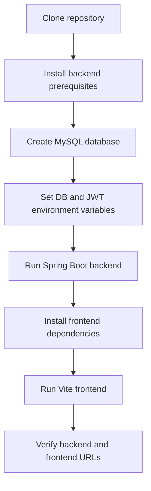
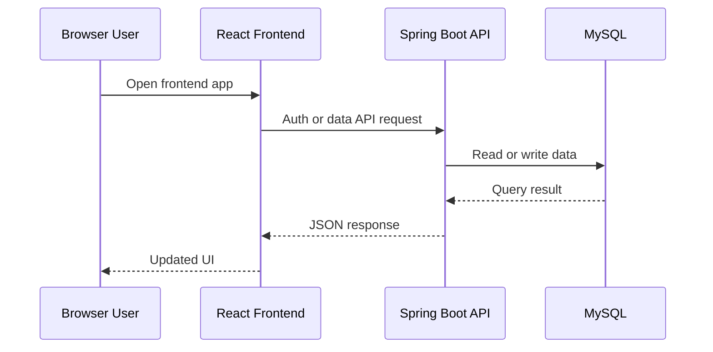

# Portfolio Manager Project Setup Instructions

This guide explains how to set up and run the Portfolio Manager project locally.

## 1. Prerequisites

- Windows, macOS, or Linux
- Java 21
- Maven 3.9+
- MySQL 8+
- Node.js 20+ and npm
- Git

## 2. Repository Structure

- Backend service: src/main/java
- Backend config: src/main/resources/application.properties
- Frontend app: frontend/
- Supporting docs and scripts: docs/

## 3. Clone and Open

```bash
git clone https://github.com/creativityexhausted/PortfolioManagement.git
cd PortfolioManagement/OneDrive/Desktop/P-Mgmt
```

## 4. Backend Setup

### 4.1 Create MySQL database

```sql
CREATE DATABASE pm;
```

### 4.2 Configure environment variables

PowerShell example:

```powershell
$env:DB_URL="jdbc:mysql://localhost:3306/pm"
$env:DB_USERNAME="root"
$env:DB_PASSWORD="your-password"
$env:JWT_SECRET="your-base64-secret"
$env:NEWS_API_KEY=""
$env:GROQ_API_KEY=""
```

### 4.3 Run backend

```powershell
mvn spring-boot:run
```

If Maven is not installed globally, run with a local Maven binary if available.

## 5. Frontend Setup

```bash
cd frontend
npm install
npm run dev -- --host
```

Frontend URL:

- http://localhost:5174/

## 6. Verify Services

- Backend health (basic check): http://localhost:8080/v3/api-docs
- Swagger UI: http://localhost:8080/swagger-ui/index.html
- Frontend: http://localhost:5174/

## 7. Setup Workflow Diagram



## 8. Runtime Request Workflow



## 9. Common Setup Issues

- MySQL access denied:
  - Verify DB_USERNAME and DB_PASSWORD.
  - Confirm user has permissions on database pm.
- Java version mismatch:
  - Ensure Java 21 is active in your terminal session.
- Node engine warnings:
  - Upgrade Node.js to version 20+.
- Port conflicts:
  - Backend default: 8080
  - Frontend default: 5174

## 10. Recommended First Validation

1. Start backend and verify /v3/api-docs returns HTTP 200.
2. Start frontend and verify the app loads in browser.
3. Register a user via API and confirm login returns a JWT token.
